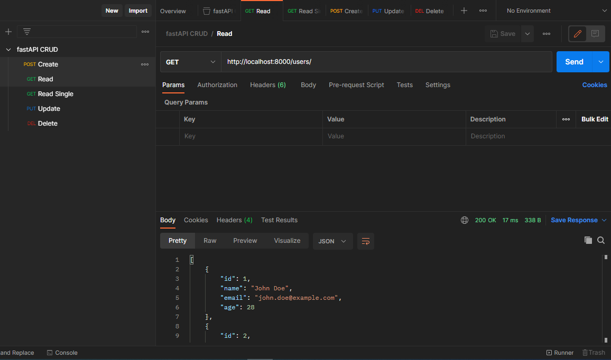

# fastapi-crud
 
 [Download the Postman File](https://raw.githubusercontent.com/thomas-ogma/fastapi-crud/main/fastAPI%20CRUD.postman_collection.json)

## How to run?

1. install the FastAPI and uvicorn modules by running the following command in the terminal:
pip install fastapi uvicorn

2. Save file with name main.py and run using following command:
python main.py

